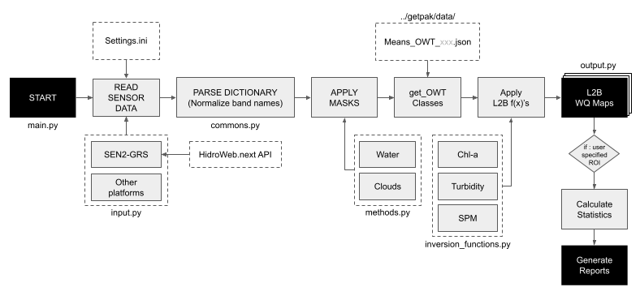
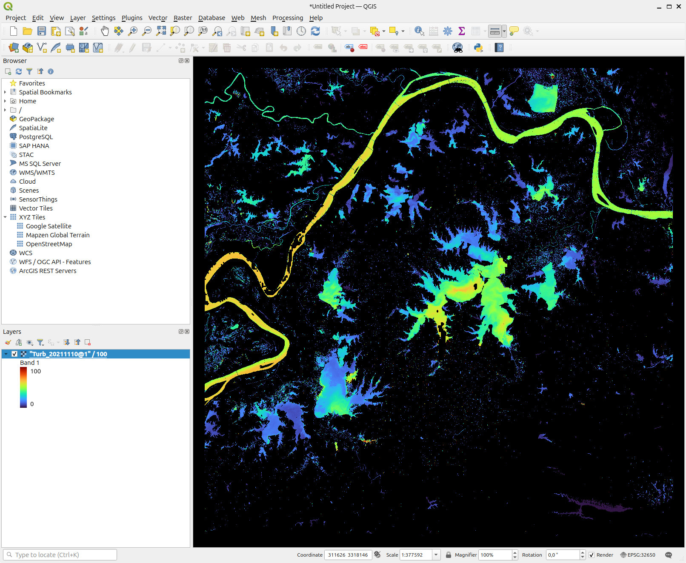
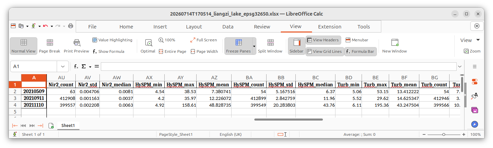

[](https://doi.org/10.5281/zenodo.21372746)
[](https://opensource.org/licenses/MIT)
 
## GET-Pak 
**G**éosciences **E**nvironnement **T**oulouse – **P**rocessing and **A**nalysis Wor**k**bench

GET-Pak is an open-source Python toolbox for reproducible inland-water quality research. It converts atmospherically corrected Sentinel-2 MSI reflectance products (especially GRS NetCDF outputs) into Level-2B water-quality maps such as suspended particulate matter, turbidity and chlorophyll-a. It also extracts statistics over user-defined regions of interest (ROI) in shapefile format, builds time series, and prepares satellite–in situ matchups for validation.

GET-Pak is designed for both interactive Jupyter workflows and automated batch processing (CLI), making it suitable for single-scene exploration, regional monitoring, and large image collections on local machines or HPC systems.

## Workflow
[](img/get-pak-workflow.png)
*Overview of the GET-Pak processing workflow, from input reflectance products and masking to Level-2B water-quality maps, ROI statistics, and report generation.*

## L2B Maps
[](img/Turb_20211110_qgis.png)
*Screenshot of a Turbidity map generated with the automated workflow.*

> [!WARNING]
> To reduce file size, GET-Pak stores output GeoTIFF values as scaled integers. Divide the stored pixel values by the corresponding scale factor to recover the physical values:
> - HySPM (`mg/L`) and turbidity (`NTU`): `100`
> - All other products: `10,000`

## Automated Report
[](img/gpk-report.png)
*Example of an automated spreadsheet report generated from the test dataset available on Zenodo.*  

> [!NOTE]
> The automated report values are automatically divided by their respective scale factors.

## Citation
A recommended citation will be added following publication of the GET-Pak software article. Auxiliary data for reproducibility purposes is available at Zenodo under the link: https://doi.org/10.5281/zenodo.20933323 containing the ROI file liangzi_lake_epsg32650.shp, 3 GRS images and 3 pre-computed water masks that can be used for a test-run to generate an example report.

## Related research
The current release use methods described in the following publications:

Harmel, T., Chami, M., Tormos, T., Reynaud, N., Danis, P.-A., 2018. Sunglint correction of the Multi-Spectral Instrument (MSI)-SENTINEL-2 imagery over inland and sea waters from SWIR bands. Remote Sensing of Environment 204, 308–321. [https://doi.org/10.1016/j.rse.2017.10.022](https://doi.org/10.1016/j.rse.2017.10.022)

Tavares, M.H., Guimarães, D., Roussillon, J., Baute, V., Cucherousset, J., Boulêtreau, S., Martinez, J.-M., 2025. A Framework to Retrieve Water Quality Parameters in Small, Optically Diverse Freshwater Ecosystems Using Sentinel-2 MSI Imagery. Remote Sensing 17, 2729. [https://doi.org/10.3390/rs17152729](https://doi.org/10.3390/rs17152729)

Cordeiro, M.C.R., Martinez, J.-M., Peña-Luque, S., 2021. Automatic water detection from multidimensional hierarchical clustering for Sentinel-2 images and a comparison with Level 2A processors. Remote Sensing of Environment 253, 112209. [https://doi.org/10.1016/j.rse.2020.112209](https://doi.org/10.1016/j.rse.2020.112209)


# `TL;DR` Install GET-Pak
> [!IMPORTANT]
> GET-Pak depends on GDAL. Using a [Miniconda](https://www.anaconda.com/docs/getting-started/miniconda/main) environment is therefore strongly recommended unless you are already comfortable managing native geospatial dependencies.

Create and activate a Conda environment with Python 3.10:
```
conda create --name gpk310 python=3.10
conda activate gpk310
```
Install GDAL before installing GET-Pak to avoid dependency-resolution errors:
```
conda install gdal
```
Clone or download the GET-Pak repository, enter its root directory, and install the required Python dependencies:
```
pip install -r requirements.txt
```
Some system-dependent packages are intentionally not included in requirements.txt. Install them separately:
```
conda install h5py libgdal-netcdf
```
Finally, install GET-Pak in editable mode:
```
pip install -e .
```
Done! You should now be able to verify the installation with a quick version check:
```
getpak --version
```
or:
```
getpak -v
```
If all went well, you should see something like:
```plaintext
(gpk310) user@MACHINE:~$ getpak -v

            _..._
          .'     '.      _
         /    .-""-\   _/ \ 
       .-|   /:.   |  |   | 
       |  \  |:.   /.-'-./ 
       | .-'-;:__.'    =/  ,ad8888ba,  88888888888 888888888888                          88
       .'=  *=|CNES _.='  d8"'    `"8b 88               88                               88
      /   _.  |    ;     d8'           88               88                               88
     ;-.-'|    \   |     88            88aaaaa          88        8b,dPPYba,  ,adPPYYba, 88   ,d8
    /   | \    _\  _\    88      88888 88"""""          88 aaaaaa 88P'    "8a ""     `Y8 88 ,a8"
    \__/'._;.  ==' ==\   Y8,        88 88               88 """""" 88       d8 ,adPPPPP88 8888[
    /|\  /|\ \    \   |   Y8a.    .a88 88               88        88b,   ,a8" 88,    ,88 88`"Yba,
   / | \/ | \/    /   /    `"Y88888P"  88888888888      88        88`YbbdP"'  `"8bbdP"Y8 88   `Y8a
  /  | || |  /-._/-._/                                            88
             \   `\  \                                            88
              `-._/._/
                        
GET-Pak version: 0.1.4
```

> [!TIP]
> You can test-run GET-Pak with the files provided [here](https://doi.org/10.5281/zenodo.21372746) (and remember to fix the paths inside your settings.ini before you run).

## Running GET-Pak

> [!IMPORTANT]
> Review and adapt `settings.ini` before launching the workflow.

After installation, run the complete settings-driven workflow:
```
getpak run
```
The above command will fetch settings.ini inside the installation folder.  
Or you can also point to a customized settings.ini file:  
```
getpak run -c /path/to/your/settings.ini
```
Run only the L2B processing step:
```
getpak l2b
```
Run only the report/time-series extraction step:
```
getpak report
```
You can also run the complete settings-driven workflow from the repository root:
```
python main.py run
```

Because the `main.py` is only a wrapper the automation module can also be launched directly, but that won't change performance:
```
python -m getpak.automation
```
If you liked GET-Pak or it supports your research, giving the repository a ⭐ can help others discover the project.